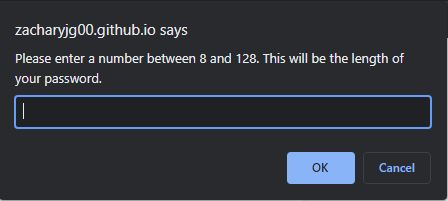
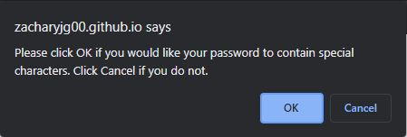
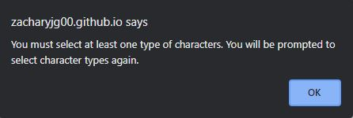
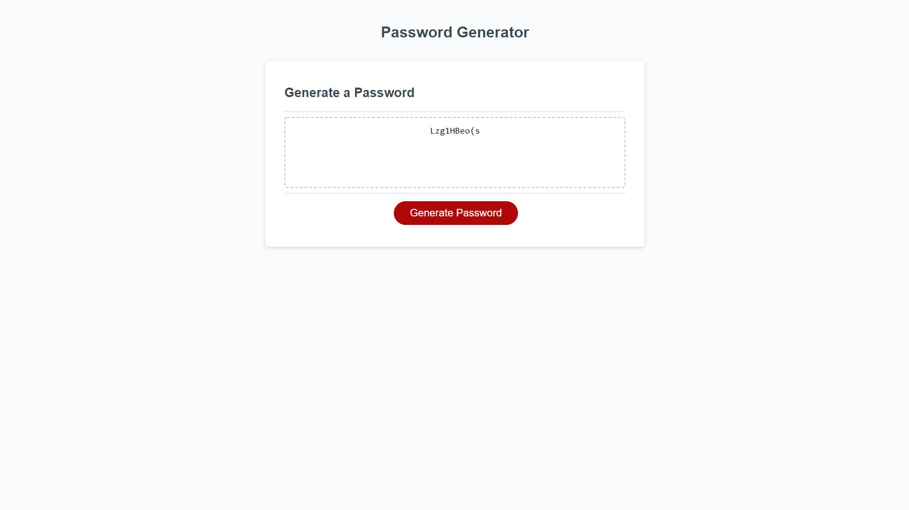

# hw-03-javascript-password-generator

This is a password generator developed in JavaScript. When the generate password button is clicked on the webpage, the user is prompted to input criteria for the password through the use of the prompt() and string() methods in JavaScript. The criteria that is asked of the user is a length between 8 and 128 as well as what character types the user would like included in the password. Once all of these criteria are chosen, a password with the given criteria is created and displayed in box in the middle of the screen.

**Above is a picture of what the webpage looks like when you first arrive.**  

 

**Above is a picture of the prompt that appears when the user is asked for a password length.**

 

**The picture above is the prompt that appears when the user is asked if they would like a certain character type included.**

 

**Above is the prompt that is shown when the user does not select any character types to be included.**

 

**This is how the webpage looks when a password of length 10 and all four character types selected looks.**

Link to deployed webpage: https://zacharyjg00.github.io/hw-03-javascript-password-generator/